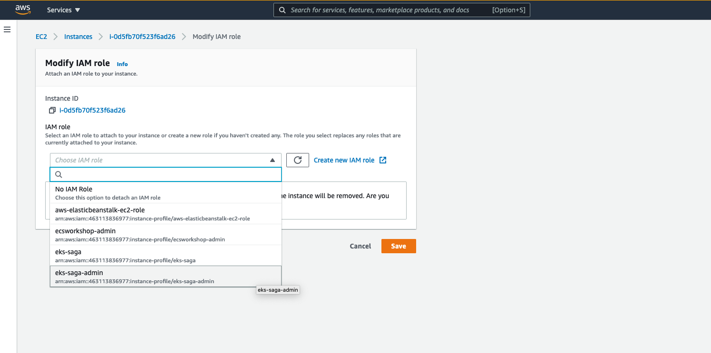
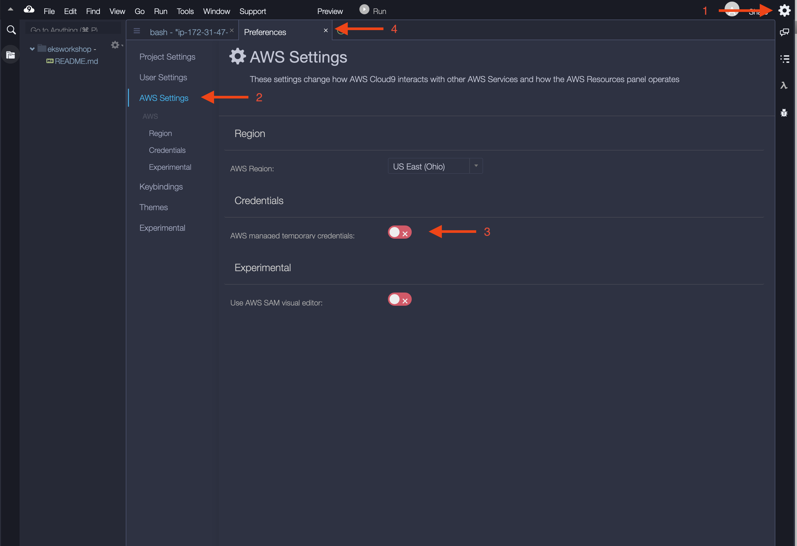

# Cloud9 set-up

1. Launch a Cloud9 workspace as described [here](https://docs.aws.amazon.com/cloud9/latest/user-guide/tutorial-create-environment.html). Use default values for all steps except for Step 8 where instance type is to be chosen as `t3.small`.
2. In the terminal, run the following comands to increase space for the IDE instance. This will reboot the instance.

```bash
pip3 install --user --upgrade boto3
export instance_id=$(curl -s http://169.254.169.254/latest/meta-data/instance-id)
python -c "import boto3
import os
from botocore.exceptions import ClientError 
ec2 = boto3.client('ec2')
volume_info = ec2.describe_volumes(
    Filters=[
        {
            'Name': 'attachment.instance-id',
            'Values': [
                os.getenv('instance_id')
            ]
        }
    ]
)
volume_id = volume_info['Volumes'][0]['VolumeId']
try:
    resize = ec2.modify_volume(    
            VolumeId=volume_id,    
            Size=30
    )
    print(resize)
except ClientError as e:
    if e.response['Error']['Code'] == 'InvalidParameterValue':
        print('ERROR MESSAGE: {}'.format(e))"
if [ $? -eq 0 ]; then
    sudo reboot
fi
```

3. Update AWS CLI.

```bash
curl "https://awscli.amazonaws.com/awscli-exe-linux-x86_64.zip" -o "awscliv2.zip"
unzip awscliv2.zip
sudo ./aws/install
```

4. Create IAM role for workspace.
   1. Follow this [deep link](https://console.aws.amazon.com/iam/home#/roles$new?step=review&commonUseCase=EC2%2BEC2&selectedUseCase=EC2&policies=arn:aws:iam::aws:policy%2FAdministratorAccess&roleName=containers-bb-admin) to create an IAM role with **Administrator** access.
   2. Confirm that AWS service and EC2 are selected, then click **Next: Permissions** to view permissions.
   3. Confirm that AdministratorAccess is checked, then click **Next: Tags** to assign tags. Take the defaults, and click **Next: Review** to review.

5. Attach IAM role to the workspace.
   1. Click the grey circle button (in top right corner) and select **Manage EC2 Instance**.


   1. Select the instance, then choose **Actions / Security / Modify IAM Role**


   2. Choose `containers-bb-admin` from the IAM Role drop down, and select **Save**.



6. Disable AWS managed credentials as shown in the screen-shot below.
  1. Return to your Cloud9 workspace and click the gear icon (in top right corner)
  2. Select AWS SETTINGS
  3. Turn off AWS managed temporary credentials
  4. Close the Preferences tab



7. Remove credentials.

```bash
rm -vf ${HOME}/.aws/credentials
```

[Go back](../install/README.md).